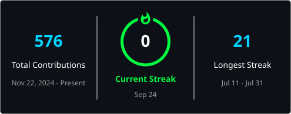

<div align="center">


<br/>


</div>

<br/>

```bash
$ whoami --verbose

Name       : Navtej Madipadiga
Role       : Full Stack Developer & AI/ML Engineer
College    : Aurora University, Hyderabad · B.Tech CS (Class of 2028)
Focus      : Building production-grade AI products, solo, end-to-end
Status     : Open to internships & collaborations
```

## 💡 About

I design and ship **full-stack products with AI baked into the core** — not bolted on. Recent work spans a Next.js career-intelligence platform wired to Gemini, a period-tracking Android app, and a Flask + MySQL pharmacy system with triggers and stored procedures running the backend.

- 🧠 Building with **Gemini** & **Claude** APIs — RAG pipelines, agentic flows, structured generation
- ⚙️ Comfortable across the stack: React/Next.js frontends → Flask/Node backends → normalized SQL schemas
- 🏆 4 hackathons, 2nd place at AVISHKRUTI (50+ teams)
- 📈 32 public repos · 17 stars earned · actively shipping

<div align="center">

| 🤖 AI Products Shipped | 🏆 Hackathons | 🥈 Best Result | ⭐ Repo Stars |
|:---:|:---:|:---:|:---:|
| **2 Live** | **4 Participated** | **2nd @ AVISHKRUTI** | **17** |

</div>

---

## 🌟 Featured Projects

<table>
<tr>
<td width="50%" valign="top">

### 🔍 [DevLens AI](https://github.com/N-AVTEJ/devlens_git)
Career intelligence platform — scans a GitHub profile, scores it across 6 dimensions with Recharts radar visuals, and generates a 5-month roadmap. Includes an "Honest Roast Mode" for brutal AI feedback.

**Stack:** Next.js 15 · React 19 · Gemini 1.5 Flash · Three.js · GSAP · Recharts

</td>
<td width="50%" valign="top">

### 🩸 [VelvetCycle Tracker](https://github.com/N-AVTEJ/VelvetCycle_tracker_app)
Native Android period-tracking app built for women's health, with an AI-assisted logging flow.

**Stack:** Kotlin · Gradle · Gemini API

</td>
</tr>
<tr>
<td width="50%" valign="top">

### 💊 [Pharmacy Protect](https://github.com/N-AVTEJ/pharmacy_protect)
Full pharmacy management system — customer + admin portals, automated billing via DB triggers, 3NF-normalized schema with stored procedures and views.

**Stack:** Flask · MySQL · Bootstrap 5 · SHA256 auth

</td>
<td width="50%" valign="top">

### 🎬 [Movie Recommender](https://github.com/N-AVTEJ/Movie_recommendation_system)
Recommendation engine combining collaborative filtering and content-based similarity scoring.

**Stack:** Python · Scikit-learn · Pandas · Streamlit

</td>
</tr>
<tr>
<td width="50%" valign="top" colspan="2">

### 🔐 [Java Secure Password Manager](https://github.com/N-AVTEJ/Java_Secure-Intelligent-Password-Manager)
Encrypted credential vault with intelligent password generation and secure local storage.

**Stack:** Java · Encryption · OOP · File I/O

</td>
</tr>
</table>

<div align="center">

[→ See all 32 repositories](https://github.com/N-AVTEJ?tab=repositories)

</div>

---

## 💻 Technologies & Tools

<div align="center">


</div>

| Layer | Tools |
|:---|:---|
| 🎨 **Frontend** | Next.js · React · TypeScript · Tailwind CSS · Three.js |
| ⚙️ **Backend** | Node.js · Express · Flask |
| 🤖 **AI/ML** | Gemini API · Claude API · Scikit-learn · TensorFlow |
| 🗄️ **Data** | PostgreSQL · MySQL · MongoDB · Supabase |
| 🚀 **DevOps** | Docker · Git · GitHub Actions · Vercel |

---

## 🏆 Achievements

| Year | Result |
|:---:|:---|
| 🥈 2025 | **2nd Place** — AVISHKRUTI Build-a-Thon (50+ teams) |
| 🏆 2025 | **Top 1000** — Vibe Hacks (HackWithIndia) |
| 🎯 2025 | **Finalist** — IIT Hyderabad Hackathon |
| 🎯 2025 | **Finalist** — IIT Madras Hackathon |

---

## 📊 GitHub Analytics

<div align="center">





</div>

---

<div align="center">

## 🌐 Let's Connect

📍 Hyderabad, India &nbsp;·&nbsp; 🎓 Aurora University, Class of 2028 &nbsp;·&nbsp; 🤝 Open to internships & collabs

<a href="mailto:navtejmadipdiga@gmail.com"></a>
<a href="https://github.com/N-AVTEJ"></a>

<br/><br/>

**"Ship fast. Learn faster. Build smarter."*


</div>

