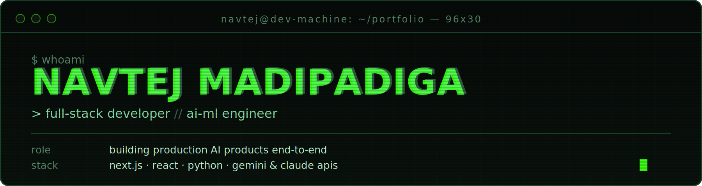

<div align="center">

</div>

<br/>

```
$ cat about.md
```

I design and ship **full-stack products with AI at the core** — not bolted on after. Recent work: a career-intelligence platform wired to Gemini, a native period-tracking app, and a pharmacy system with triggers and stored procedures running the backend. B.Tech CS at Aurora University, Hyderabad, class of 2028.

<table width="100%">
<tr>
<td width="25%" align="center" valign="top">

<pre>
┌────────────┐
│  AI SHIPS  │
│     2      │
└────────────┘
</pre>

</td>
<td width="25%" align="center" valign="top">

<pre>
┌────────────┐
│ HACKATHONS │
│     4      │
└────────────┘
</pre>

</td>
<td width="25%" align="center" valign="top">

<pre>
┌────────────┐
│ BEST RANK  │
│  2nd / 50+ │
└────────────┘
</pre>

</td>
<td width="25%" align="center" valign="top">

<pre>
┌────────────┐
│ ACTIVE REPO│
│     32     │
└────────────┘
</pre>

</td>
</tr>
</table>

---

```
$ ls projects/ --starred
```

<table width="100%">
<tr><td width="50%" valign="top">

**[devlens_git](https://github.com/N-AVTEJ/devlens_git)** `★ 5`<br/>
GitHub career-intelligence platform. Scores a profile across 6 dimensions on a Recharts radar, renders a 3D hero, generates a 5-month roadmap. Ships an "honest roast mode" for unfiltered AI feedback.<br/>
`next.js 15` `react 19` `gemini 1.5` `three.js` `gsap`

</td><td width="50%" valign="top">

**[VelvetCycle_tracker_app](https://github.com/N-AVTEJ/VelvetCycle_tracker_app)** `★ 5`<br/>
Native Android period-tracking app for women's health with an AI-assisted logging flow.<br/>
`kotlin` `gradle` `gemini api`

</td></tr>
<tr><td width="50%" valign="top">

**[pharmacy_protect](https://github.com/N-AVTEJ/pharmacy_protect)** `★ 5`<br/>
Pharmacy management system — customer and admin portals, automated billing via DB triggers, 3NF schema with stored procedures.<br/>
`flask` `mysql` `bootstrap 5`

</td><td width="50%" valign="top">

**[Movie_recommendation_system](https://github.com/N-AVTEJ/Movie_recommendation_system)** `★ 7`<br/>
Recommendation engine blending collaborative filtering with content-based similarity scoring.<br/>
`python` `scikit-learn` `streamlit`

</td></tr>
<tr><td width="50%" valign="top" colspan="2">

**[Java_Secure-Intelligent-Password-Manager](https://github.com/N-AVTEJ/Java_Secure-Intelligent-Password-Manager)** `★ 7`<br/>
Encrypted credential vault with intelligent password generation and secure local storage.<br/>
`java` `encryption` `oop`

</td></tr>
</table>

<div align="center"><sub><a href="https://github.com/N-AVTEJ?tab=repositories">→ all 32 repositories</a></sub></div>

---

```
$ cat skills.json | jq
```

<table width="100%">
<tr><td width="50%" valign="top">

<pre>
frontend    ██████████  react · next.js · ts
backend     ██████████  node · express · flask
ai / ml     ████████░░  gemini · claude · sklearn
databases   ████████░░  postgres · mysql · mongo
devops      ████████░░  docker · actions · vercel
</pre>

</td><td width="50%" valign="top">

<pre>
languages   python · typescript · java · kotlin
frontend    next.js · react · tailwind · three.js
backend     node.js · express · flask
ai / ml     gemini api · claude api · tensorflow
data        postgresql · mysql · mongodb · supabase
devops      docker · git · github actions · vercel
</pre>

</td></tr>
</table>

---

```
$ cat achievements.log
```

```
2025-Q3  [2ND PLACE]  AVISHKRUTI Build-a-Thon        · 50+ teams
2025-Q3  [TOP 1000]   Vibe Hacks — HackWithIndia
2025-Q2  [FINALIST]   IIT Hyderabad Hackathon
2025-Q2  [FINALIST]   IIT Madras Hackathon
```

---

```
$ curl -s api.github.com/users/N-AVTEJ | jq .contributions
```

<div align="center">


</div>

---

```
$ ./scripts/print-trophies.sh
```

<div align="center">

</div>

---

```
$ git log --graph --oneline --all | ./animate
```

<div align="center">


</div>

<sub align="center">rebuilds daily via <code>.github/workflows/snake.yml</code> — needs one manual run under the Actions tab to seed the <code>output</code> branch</sub>

---

```
$ wakatime stats --last-7-days
```

<div align="center">

</div>

<sub align="center">swap <code>YOUR_WAKATIME_USER_ID</code> for your public profile ID after connecting a <a href="https://wakatime.com">WakaTime</a> account — find it under wakatime.com/settings/account</sub>

---

<div align="center">


<br/><br/>

📍 Hyderabad, India &nbsp;·&nbsp; 🎓 Aurora University, class of 2028 &nbsp;·&nbsp; open to internships & collabs

<a href="mailto:navtejmadipdiga@gmail.com">email</a> &nbsp;·&nbsp;
<a href="https://github.com/N-AVTEJ">github</a> &nbsp;·&nbsp;
<a href="#">linkedin</a>

</div>
